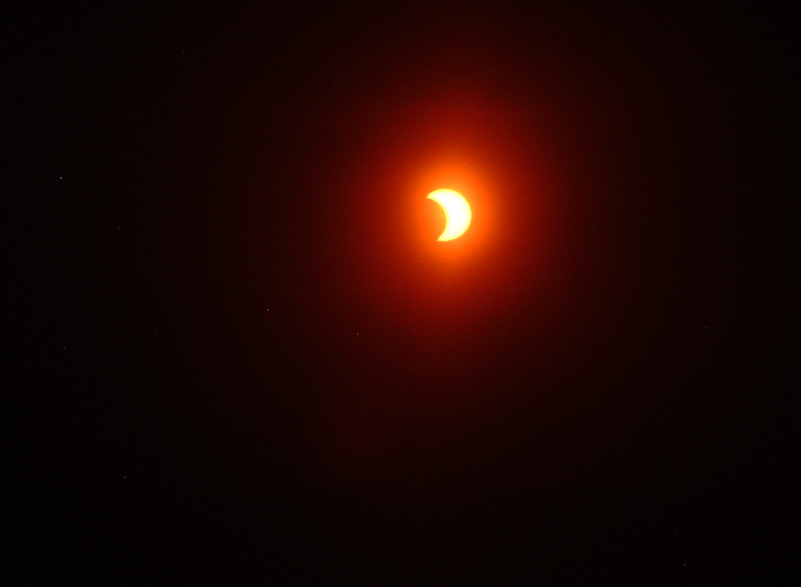

::::: {id="parent"}

# Hey I'm **Alex**...
::: {id="normalText"}
&nbsp;&nbsp;&nbsp;...an aspiring computer engineering student who will be attending the [**University of Waterloo**](https://uwaterloo.ca/future-students/programs/computer-engineering) in the fall of 2024! 

&nbsp; 

As a soon to be undgergrad student, I have many interests! Although I have and always will be captivated by space exploration, I am currently focused on continuing my studies in the areas of programming, computer technology, physics and mathematics! If you'd like to learn more about how I pursue this, I welcome you to view some of the [projects](./projects.html) I've built, or connect with me through my email, [linkedin](https://ca.linkedin.com/in/alexander-sotnikov-94295b2b3) or [github](https://github.com/100nik0v) :)

&nbsp;

Besides my love for computers and space, I also have a wide array of hobbies, and interests!
Some of them are:

- **Taekwondo**! I have enjoyed this sport since second grade, and recently received a second dan black belt.
- **Chess** has also been a major part of my life, having participated in dozens of chess tournaments. In high school I even organized a chess club, a championship winning chess team, and a tournament as part of the TDSB Chess League!
- **Photography** is another favourite pastime that I don't intend to leave behind when I attend Waterloo! You can view some of my photography portfolio below:
:::

:::: {class="outer"}
::: {}
{id="img"}
:::
::: {}
{id="img"}
:::
::: {}
{id="img"}
:::
::: {}
{id="img"}
:::
::: {}
{id="img"}
:::
::::
:::::
