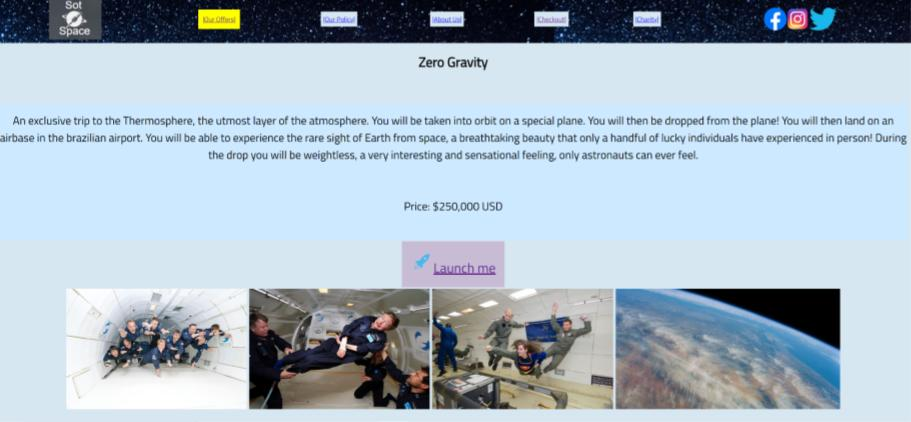
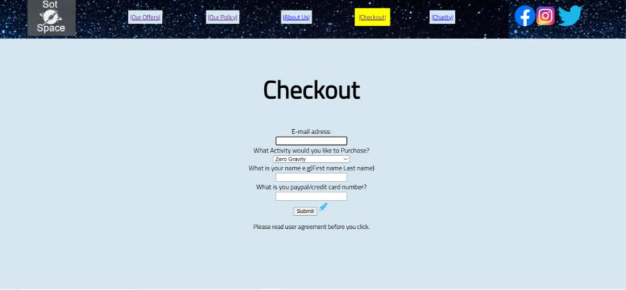
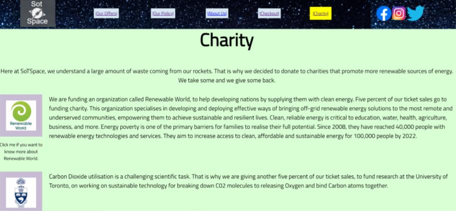

&nbsp;

# **Projects**

::::: {id="parent"}

::: {id="wide"}
> ## Fictional Company Website

##### **Description: **

Created for the BTT101 course, to showcase knowledge of CSS and HTML. Project is a website for a fictional space company.

#### **Skills: ** `HTML` , `CSS`

[View project on Github](https://github.com/100nik0v/SoTSpace)
:::

:::: {id="narrow"}

::: {}

:::
::: {}

:::

::: {}

:::

::::

:::::

:::: {id="parent"}

::: {id="wide"}
> ## Project 2

##### **Description:**

Lorem IpsumLorem IpsumLorem IpsumLorem IpsumLorem IpsumLorem IpsumLorem IpsumLorem IpsumLorem IpsumLorem IpsumLorem IpsumLorem IpsumLorem IpsumLorem IpsumLorem IpsumLorem IpsumLorem IpsumLorem IpsumLorem IpsumLorem Ipsum

[View project on Github](github.com)
:::

::: {id="narrow"}

:::

::::

:::: {id="parent"}

::: {id="wide"}
> ## Project 3

##### **Description:**

Lorem IpsumLorem IpsumLorem IpsumLorem IpsumLorem IpsumLorem IpsumLorem IpsumLorem IpsumLorem IpsumLorem IpsumLorem IpsumLorem IpsumLorem IpsumLorem IpsumLorem IpsumLorem IpsumLorem IpsumLorem IpsumLorem IpsumLorem Ipsum

[View project on Github](github.com)
:::

::: {id="narrow"}
{id="image"}
:::

::::